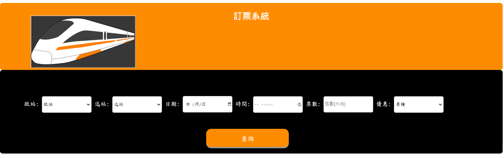
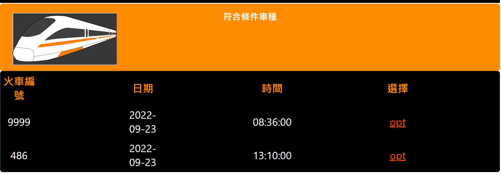
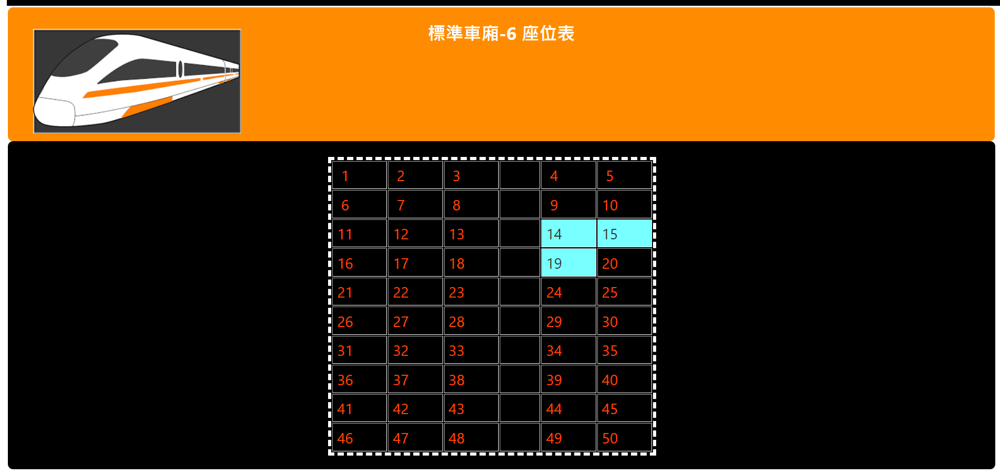
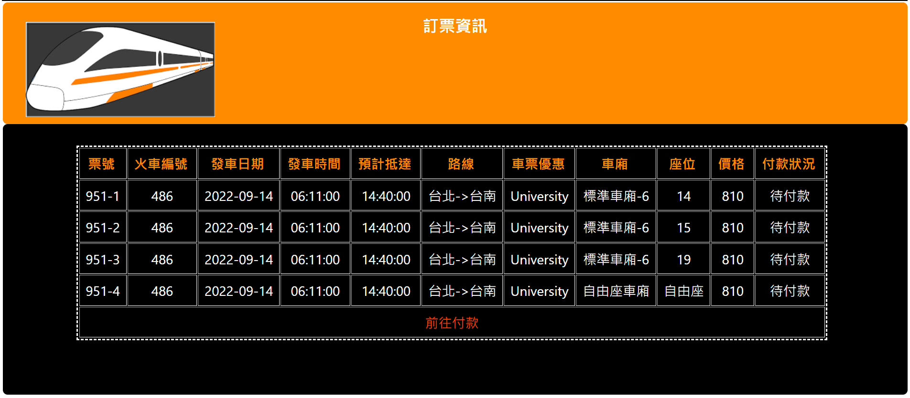
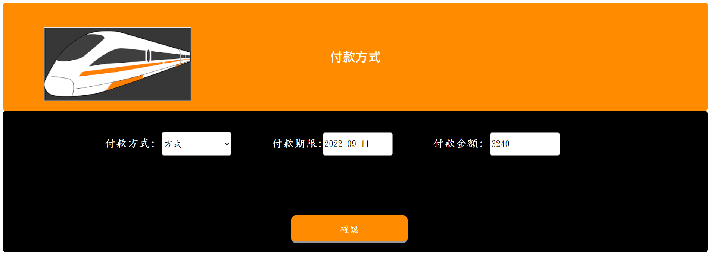
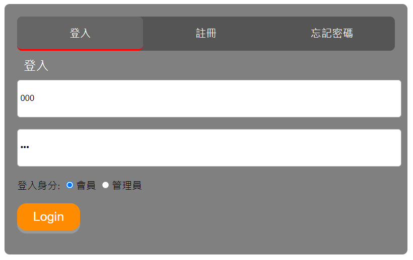
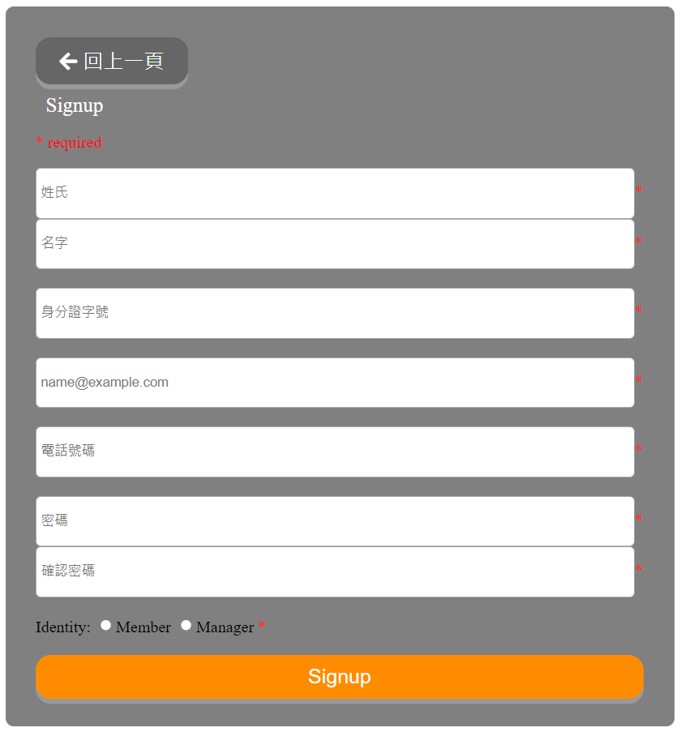
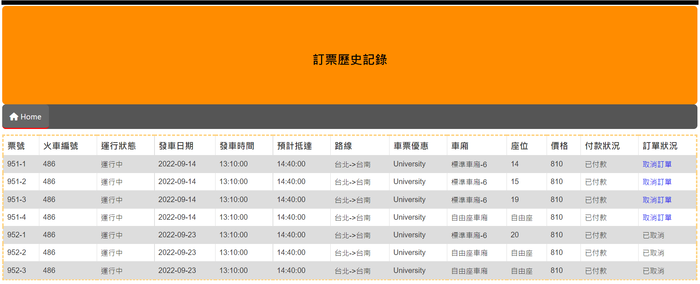

# Seat_Reservation_System
The seat reservation system simulate the Taiwan High Speed Ray booking system.

##User interface

  

##Booking interface

  

  

  

  

  

  

##Login interface

  

##Registration Interface

  

##Booking History

  

